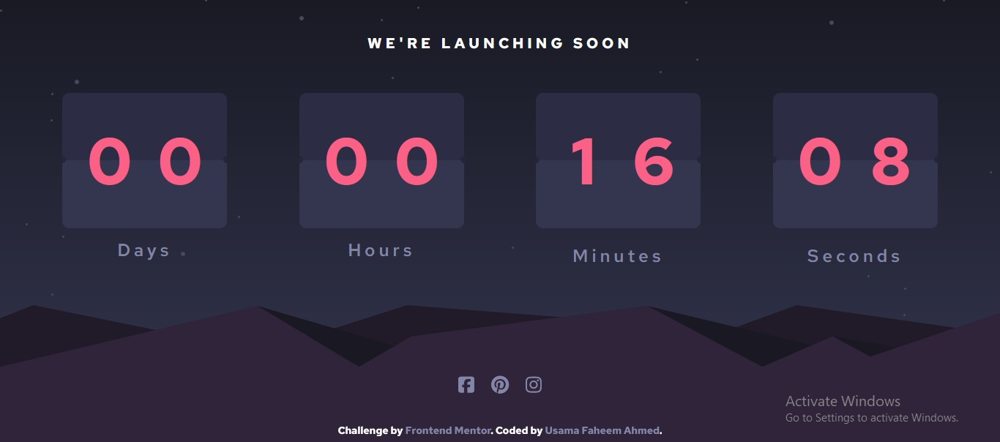

# Frontend Mentor - Launch countdown timer solution

This is a solution to the [Launch countdown timer challenge on Frontend Mentor](https://www.frontendmentor.io/challenges/launch-countdown-timer-N0XkGfyz-). Frontend Mentor challenges help you improve your coding skills by building realistic projects. 

## Table of contents

- [Overview](#overview)
  - [The challenge](#the-challenge)
  - [Screenshot](#screenshot)
  - [Links](#links)
- [My process](#my-process)
  - [Built with](#built-with)
  - [What I learned](#what-i-learned)
  - [Continued development](#continued-development)
  - [Useful resources](#useful-resources)
- [Author](#author)
- [Acknowledgments](#acknowledgments)

**Note: Delete this note and update the table of contents based on what sections you keep.**

## Overview

### The challenge

Users should be able to:

- See hover states for all interactive elements on the page
- See a live countdown timer that ticks down every second (start the count at 14 days)
- **Bonus**: When a number changes, make the card flip from the middle

### Screenshot




Add a screenshot of your solution. The easiest way to do this is to use Firefox to view your project, right-click the page and select "Take a Screenshot". You can choose either a full-height screenshot or a cropped one based on how long the page is. If it's very long, it might be best to crop it.

Alternatively, you can use a tool like [FireShot](https://getfireshot.com/) to take the screenshot. FireShot has a free option, so you don't need to purchase it. 

Then crop/optimize/edit your image however you like, add it to your project, and update the file path in the image above.

**Note: Delete this note and the paragraphs above when you add your screenshot. If you prefer not to add a screenshot, feel free to remove this entire section.**

### Links

- Solution URL: [Usama Faheem Ahmed Github](https://github.com/usamafaheemAhmed/Count-Down-Animation.git)
- Live Site URL: [Usama Faheem Ahmed Live Projects](http://usama-faheem.000webhostapp.com/Portfolio/Java_Script_Projects/JsCountDown/)

## My process

### Built with

- Simple HTML
- Css
- JavaScript

**Note: These are just examples. Delete this note and replace the list above with your own choices**

### What I learned

Use this section to recap over some of your major learnings while working through this project. Writing these out and providing code samples of areas you want to highlight is a great way to reinforce your own knowledge.

To see how you can add code snippets, see below:

```html
<!DOCTYPE html>
<html lang="en">
  <head>
    <meta charset="UTF-8" />
    <meta
      name="viewport"
      content="width=device-width, initial-scale=1, shrink-to-fit=no"
    />

    <link
      rel="icon"
      type="image/png"
      sizes="32x32"
      href="./images/favicon-32x32.png"
    />

    <title>Frontend Mentor | Launch countdown timer</title>

    <!-- Required meta tags -->

    <!-- Bootstrap CSS v5.2.1 -->
    <link
      href="https://cdn.jsdelivr.net/npm/bootstrap@5.3.2/dist/css/bootstrap.min.css"
      rel="stylesheet"
      integrity="sha384-T3c6CoIi6uLrA9TneNEoa7RxnatzjcDSCmG1MXxSR1GAsXEV/Dwwykc2MPK8M2HN"
      crossorigin="anonymous"
    />

    <link rel="stylesheet" href="https://cdnjs.cloudflare.com/ajax/libs/font-awesome/6.5.1/css/all.min.css" integrity="sha512-DTOQO9RWCH3ppGqcWaEA1BIZOC6xxalwEsw9c2QQeAIftl+Vegovlnee1c9QX4TctnWMn13TZye+giMm8e2LwA==" crossorigin="anonymous" referrerpolicy="no-referrer" />

    <!-- Feel free to remove these styles or customise in your own stylesheet 👍 -->
    <!-- <style>
    .attribution { font-size: 11px; text-align: center; }
    .attribution a { color: hsl(228, 45%, 44%); }
  </style> -->
    <link rel="stylesheet" href="style.css" />
  </head>
  <body>
    <!-- We're launching soon
  

  Days
  Hours
  Minutes
  Seconds -->

    <div class="container-fluid p-0">
      <div class="postion-relative vh-100">
        <div
          class="position-absolute w-100 vh-100 overflow-hidden"
          style="z-index: -1"
        >
          
        </div>
        <div class="position-absolute bottom-0 w-100 overflow-hidden">
          
        </div>

        <div class="postion-relative vh-100 px-5" style="z-index: 1;">
          <div class="row">
            <div class="col-md-12 text-center">
              <h5 class="mt-5"><strong>We're launching soon</strong></h5>
            </div>
          </div>
          <div class="row mt-5">
            <div class="col-md-3 text-center">
              <div class="flip">
                <div class="flip-Counter-2">
                  <div class="row px-3">
                    <div class="w-50 pe-0" id="DayUp_1">0</div>
                    <div class="w-50 ps-0 " id="DayUp_2">4</div>
                    <div class="w-50 pe-0" id="DayDown_1">0</div>
                    <div class="w-50 ps-0 " id="DayDown_2">3</div>
                  </div>
                </div>
              </div>
              <h4 class="mt-3">Days</h4>
            </div>
            <div class="col-md-3 text-center">
              <div class="flip">
                <div class="flip-Counter-2">
                  <div class="row px-3">
                    <div class="w-50 pe-0"  id="HoursUp_1">0</div>
                    <div class="w-50 ps-0 "  id="HoursUp_2">4</div>
                    <div class="w-50 pe-0" id="HoursDown_1">0</div>
                    <div class="w-50 ps-0 " id="HoursDown_2">3</div>
                  </div>
                </div>
              </div>
              <h4 class="mt-3">Hours</h4>
            </div>
            <div class="col-md-3 text-center">
              <div class="flip">
                <div class="flip-Counter-2">
                  <div class="row px-3">
                    <div class="w-50 pe-0" id="MinUp_1">0</div>
                    <div class="w-50 ps-0 "  id="MinUp_2">4</div>
                    <div class="w-50 pe-0" id="MinDown_1">0</div>
                    <div class="w-50 ps-0 " id="MinDown_2">3</div>
                  </div>
                </div>
              </div>
              <h4 class="mt-4">Minutes</h4>
            </div>
            <div class="col-md-3 text-center">
              <div class="flip">
                <div class="flip-Counter-2">
                  <div class="row px-3">
                    <div class="w-50 pe-0" id="SecUp_1">0</div>
                    <div class="w-50 ps-0 "  id="SecUp_2">4</div>
                    <div class="w-50 pe-0" id="SecDown_1">0</div>
                    <div class="w-50 ps-0 " id="SecDown_2">3</div>
                  </div>
                </div>
              </div>
              <h4 class="mt-4"> Seconds</h4>
            </div>
          </div>
        </div>
      </div>
    </div>


    <div class="position-fixed bottom-0  text-center w-100" style="margin-bottom: 5%;">
      
      <a class="Icons" href="#" target="_blank"><i class="fa fa-brands fa-square-facebook"></i></a>
      <a class="Icons" href="#" target="_blank"><i class="fa fa-brands fa-pinterest"></i></a>
      <a class="Icons" href="#" target="_blank"><i class="fa fa-brands fa-instagram"></i></a>

    </div>

    <div class="position-fixed bottom-0 mb-3 text-center w-100">
      Challenge by
      <a href="#" target="_blank">Frontend Mentor</a>. Coded by
      <a href="#">Usama Faheem Ahmed</a>.
    </div>

    <script
      src="https://cdn.jsdelivr.net/npm/@popperjs/core@2.11.8/dist/umd/popper.min.js"
      integrity="sha384-I7E8VVD/ismYTF4hNIPjVp/Zjvgyol6VFvRkX/vR+Vc4jQkC+hVqc2pM8ODewa9r"
      crossorigin="anonymous"
    ></script>

    <script
      src="https://cdn.jsdelivr.net/npm/bootstrap@5.3.2/dist/js/bootstrap.min.js"
      integrity="sha384-BBtl+eGJRgqQAUMxJ7pMwbEyER4l1g+O15P+16Ep7Q9Q+zqX6gSbd85u4mG4QzX+"
      crossorigin="anonymous"
    ></script>
    <script src="./script.js"></script>
  </body>
</html>

```
```css
@import url("https://fonts.googleapis.com/css2?family=Red+Hat+Text:ital,wght@0,400;0,500;0,600;0,700;1,400;1,500;1,600;1,700&display=swap");

body {
  font-family: "Red Hat Text", sans-serif;
  /* position: relative; */

  background: #191a24;
  background: linear-gradient(180deg, #191a24 0%, #343650 100%);

  color: white;
  font-weight: 700;
  font-size: 14px;
}
a:hover {
  color: #fb6087;
  text-decoration: underline;
}
a {
  color: #8486a9;
  text-decoration: none;
}
h5 {
  letter-spacing: 5px;
  text-transform: uppercase;
}
h4{
  letter-spacing: 5px;
  /* font-weight: 500; */
  color: #8486a9;
}

ul {
  list-style: none;
}

.flip {
    color: #fb6087;
  width: 75%;
  margin: 0px auto 0px auto;
  padding: 0px 0px 0px 0px;
}

.flip-Counter-2{
    position: relative;
    /* background-color: #191a24; */
    background: #2c2c44;
    background: linear-gradient(180deg, #2c2c44 50%, #34364f 50%);
    
    border-radius: 10px;
    height: 30vh;
    width: 100%;
    font-size: 90px;
    padding-top: 25px;
    overflow: hidden;
}

.flip-Counter-2::before {
    position: absolute;
    top: 14vh;
    left: -5px;
    content: "";
    border-radius: 50%;
    height: 10px;
    width: 10px;
    background-color: #252738;
  }
  

  .flip-Counter-2::after {
    position: absolute;
    top: 14vh;
    right: -5px;
    content: "";
    border-radius: 50%;
    height: 10px;
    width: 10px;
    background-color: #252738;
  }

  .Icons{
    font-size: 25px;
    margin: 0px 10px 0px 10px;
  }


.swing-top-fwd {
  -webkit-animation: swing-top-fwd 1s cubic-bezier(0.25, 0.46, 0.45, 0.94)
    both infinite;
  animation: swing-top-fwd 1s cubic-bezier(0.25, 0.46, 0.45, 0.94) both
    infinite;
}

/* ----------------------------------------------
 * Generated by Animista on 2024-1-20 23:35:21
 * Licensed under FreeBSD License.
 * See http://animista.net/license for more info. 
 * w: http://animista.net, t: @cssanimista
 * ---------------------------------------------- */

/**
 * ----------------------------------------
 * animation swing-top-fwd
 * ----------------------------------------
 */
@-webkit-keyframes swing-top-fwd {
  0% {
    -webkit-transform: rotateX(180deg);
    transform: rotateX(180deg);
    -webkit-transform-origin: top;
    transform-origin: top;
    opacity: 0;
  }
  100% {
    -webkit-transform: rotateX(0deg);
    transform: rotateX(0deg);
    -webkit-transform-origin: top;
    transform-origin: top;
    opacity: 1;
  }
}
@keyframes swing-top-fwd {
  0% {
    -webkit-transform: rotateX(180deg);
    transform: rotateX(180deg);
    -webkit-transform-origin: top;
    transform-origin: top;
    opacity: 0;
  }
  100% {
    -webkit-transform: rotateX(0deg);
    transform: rotateX(0deg);
    -webkit-transform-origin: top;
    transform-origin: top;
    opacity: 1;
  }
}


.slide-bottom {
	-webkit-animation: slide-bottom 1s cubic-bezier(0.250, 0.460, 0.450, 0.940) both ;
	        animation: slide-bottom 1s cubic-bezier(0.250, 0.460, 0.450, 0.940) both ;
}


/* ----------------------------------------------
 * Generated by Animista on 2024-1-20 23:48:50
 * Licensed under FreeBSD License.
 * See http://animista.net/license for more info. 
 * w: http://animista.net, t: @cssanimista
 * ---------------------------------------------- */

/**
 * ----------------------------------------
 * animation slide-bottom
 * ----------------------------------------
 */
 @-webkit-keyframes slide-bottom {
    0% {
      -webkit-transform: translateY(-136px);
              transform: translateY(-136px);
    }
    100% {
      -webkit-transform: translateY(0);
              transform: translateY(0);
    }
  }
  @keyframes slide-bottom {
    0% {
      -webkit-transform: translateY(-136px);
              transform: translateY(-136px);
    }
    100% {
      -webkit-transform: translateY(0);
              transform: translateY(0);
    }
  }
  
  .slide-top {
	-webkit-animation: slide-top 0.5s cubic-bezier(0.250, 0.460, 0.450, 0.940) both ;
	        animation: slide-top 0.5s cubic-bezier(0.250, 0.460, 0.450, 0.940) both ;
}
  /* ----------------------------------------------
 * Generated by Animista on 2024-1-21 0:0:31
 * Licensed under FreeBSD License.
 * See http://animista.net/license for more info. 
 * w: http://animista.net, t: @cssanimista
 * ---------------------------------------------- */

/**
 * ----------------------------------------
 * animation slide-top
 * ----------------------------------------
 */
@-webkit-keyframes slide-top {
    0% {
      -webkit-transform: translateY(0);
              transform: translateY(0);
    }
    100% {
      -webkit-transform: translateY(-136px);
              transform: translateY(-136px);
    }
  }
  @keyframes slide-top {
    0% {
      -webkit-transform: translateY(0);
              transform: translateY(0);
    }
    100% {
      -webkit-transform: translateY(-136px);
              transform: translateY(-136px);
    }
  }
  
```
```js
function Timer() {
    let secUp1 = document.getElementById("SecUp_1");
    let secUp2 = document.getElementById("SecUp_2");
    let secDown1 = document.getElementById("SecDown_1");
    let secDown2 = document.getElementById("SecDown_2");


    let DayUp_1 = document.getElementById("DayUp_1");
    let DayUp_2 = document.getElementById("DayUp_2");
    let DayDown_1 = document.getElementById("DayDown_1");
    let DayDown_2 = document.getElementById("DayDown_2");

    let HoursUp_1 = document.getElementById("HoursUp_1");
    let HoursUp_2 = document.getElementById("HoursUp_2");
    let HoursDown_1 = document.getElementById("HoursDown_1");
    let HoursDown_2 = document.getElementById("HoursDown_2");

    let MinUp_1 = document.getElementById("MinUp_1");
    let MinUp_2 = document.getElementById("MinUp_2");
    let MinDown_1 = document.getElementById("MinDown_1");
    let MinDown_2 = document.getElementById("MinDown_2");


    let loopLimit = 3 * 24 * 60 * 60; // 3 days in seconds
    // alert(loopLimit)
    let interval = 1000; // 1 second
    // let interval = 0; // 1 second

    let count = 0;

    let countdownInterval = setInterval(function () {
        // Calculate time units
        let seconds = count % 60;
        let minutes = Math.floor((count / 60) % 60);
        let hours = Math.floor((count / 3600) % 24);
        let days = Math.floor(count / (24 * 3600));

        // Update the flip counters
        secUp1.innerText = Math.floor(seconds / 10);
        secUp2.innerText = seconds % 10;
        // secDown1.innerText = Math.floor(seconds / 10);
        // secDown2.innerText = seconds % 10;

        // Apply animation class
        secUp2.classList.add("slide-bottom");
        secDown2.classList.add("slide-bottom");

        // Remove animation class after animation completes
        setTimeout(function () {
            secUp2.classList.remove("slide-bottom");
            secDown2.classList.remove("slide-bottom");

            secDown1.innerText = Math.floor(seconds / 10);
            secDown2.innerText = seconds % 10;
        }, 500); // Adjust the duration of the animation

        // Check for 10 seconds
        if (seconds % 10 === 0) {
            secUp1.classList.add("slide-bottom");
            secDown1.classList.add("slide-bottom");

            // Remove animation class after animation completes
            setTimeout(function () {
                secUp1.classList.remove("slide-bottom");
                secDown1.classList.remove("slide-bottom");
            }, 500); // Adjust the duration of the animation
        }

        // Check for 1 minute
        if (seconds === 0) {
            // Update your flip counters for minutes (MinUp_2, MinDown_2, etc.)
            // with appropriate values and animation classes if needed.
            // alert(minutes % 10);

            MinUp_1.innerText = Math.floor(minutes / 10);
            MinUp_2.innerText = minutes % 10;
            // MinDown_1.innerText = Math.floor(minutes / 10);
            // MinDown_2.innerText = minutes % 10;

            MinUp_2.classList.add("slide-bottom");
            MinDown_2.classList.add("slide-bottom");

            // Remove animation class after animation completes
            setTimeout(function () {
                MinUp_2.classList.remove("slide-bottom");
                MinDown_2.classList.remove("slide-bottom");

                MinDown_1.innerText = Math.floor(minutes / 10);
                MinDown_2.innerText = minutes % 10;
            }, 500); // Adjust the duration of the animation


            // Check for 10 minuts
            if (minutes % 10 === 0) {
                MinUp_1.classList.add("slide-bottom");
                MinDown_1.classList.add("slide-bottom");

                // Remove animation class after animation completes
                setTimeout(function () {
                    MinUp_1.classList.remove("slide-bottom");
                    MinDown_1.classList.remove("slide-bottom");
                }, 500); // Adjust the duration of the animation
            }


        }

        // Check for 1 hour
        if (minutes === 0 && seconds === 0) {
            // Update your flip counters for hours with appropriate values and animation classes if needed.

            // Update the flip counters
            HoursUp_1.innerText = Math.floor(hours / 10);
            HoursUp_2.innerText = hours % 10;
            // HoursDown_1.innerText = Math.floor(hours / 10);
            // HoursDown_2.innerText = hours % 10;

            // Apply animation class
            HoursUp_2.classList.add("slide-bottom");
            HoursDown_2.classList.add("slide-bottom");

            // Remove animation class after animation completes
            setTimeout(function () {
                HoursUp_2.classList.remove("slide-bottom");
                HoursDown_2.classList.remove("slide-bottom");

                HoursDown_1.innerText = Math.floor(hours / 10);
                HoursDown_2.innerText = hours % 10;
            }, 500); // Adjust the duration of the animation

            // Check for 10 seconds
            if (hours % 10 === 0) {
                HoursUp_1.classList.add("slide-bottom");
                HoursDown_1.classList.add("slide-bottom");

                // Remove animation class after animation completes
                setTimeout(function () {
                    HoursUp_1.classList.remove("slide-bottom");
                    HoursDown_1.classList.remove("slide-bottom");
                }, 500); // Adjust the duration of the animation
            }

        }

        // Check for 1 day
        if (hours === 0 && minutes === 0 && seconds === 0) {
            // Update your flip counters for days with appropriate values and animation classes if needed.

            // Update the flip counters
            DayUp_1.innerText = Math.floor(days / 10);
            DayUp_2.innerText = days % 10;
            // DayDown_1.innerText = Math.floor(days / 10);
            // DayDown_2.innerText = days % 10;

            // Apply animation class
            DayUp_2.classList.add("slide-bottom");
            DayDown_2.classList.add("slide-bottom");

            // Remove animation class after animation completes
            setTimeout(function () {
                DayUp_2.classList.remove("slide-bottom");
                DayDown_2.classList.remove("slide-bottom");

            DayDown_1.innerText = Math.floor(days / 10);
            DayDown_2.innerText = days % 10;
            }, 500); // Adjust the duration of the animation

            // Check for 10 seconds
            if (days % 10 === 0) {
                DayUp_1.classList.add("slide-bottom");
                DayDown_1.classList.add("slide-bottom");

                // Remove animation class after animation completes
                setTimeout(function () {
                    DayUp_1.classList.remove("slide-bottom");
                    DayDown_1.classList.remove("slide-bottom");
                }, 500); // Adjust the duration of the animation
            }


        }

        count ++;
        // count += 500;

        // Check if the countdown is complete
        if (count >= loopLimit) {
            clearInterval(countdownInterval);
            // Handle countdown completion as needed
        }
    }, interval);
}

Timer();

```

If you want more help with writing markdown, we'd recommend checking out [The Markdown Guide](https://www.markdownguide.org/) to learn more.

**Note: Delete this note and the content within this section and replace with your own learnings.**

### Continued development

Use this section to outline areas that you want to continue focusing on in future projects. These could be concepts you're still not completely comfortable with or techniques you found useful that you want to refine and perfect.

**Note: Delete this note and the content within this section and replace with your own plans for continued development.**

### Useful resources

- [Example resource 1](https://www.example.com) - This helped me for XYZ reason. I really liked this pattern and will use it going forward.
- [Example resource 2](https://www.example.com) - This is an amazing article which helped me finally understand XYZ. I'd recommend it to anyone still learning this concept.

**Note: Delete this note and replace the list above with resources that helped you during the challenge. These could come in handy for anyone viewing your solution or for yourself when you look back on this project in the future.**

## Author

- Project_link - [Project Link](http://usama-faheem.000webhostapp.com/Portfolio/Java_Script_Projects/JsCountDown/)
- Frontend Mentor - [@usamafaheemAhmed](https://www.frontendmentor.io/profile/usamafaheemAhmede)
- Github - [@usamafaheemAhmed](https://github.com/usamafaheemAhmed)

**Note: Delete this note and add/remove/edit lines above based on what links you'd like to share.**

## Acknowledgments

This is where you can give a hat tip to anyone who helped you out on this project. Perhaps you worked in a team or got some inspiration from someone else's solution. This is the perfect place to give them some credit.

**Note: Delete this note and edit this section's content as necessary. If you completed this challenge by yourself, feel free to delete this section entirely.**
